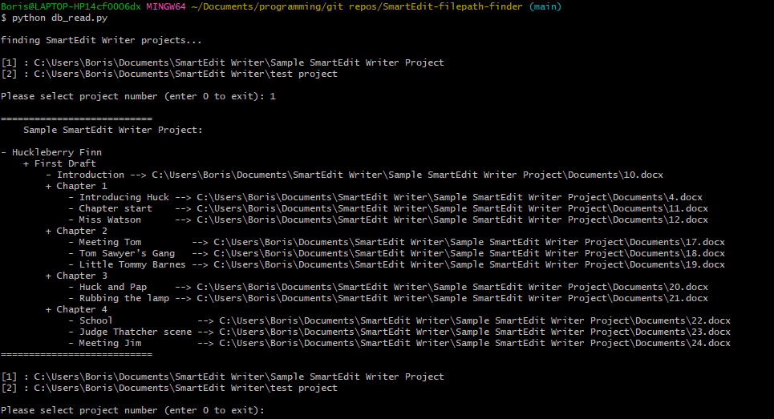

# Overview

tl;dr: A Python utility (db_read.py) that finds source filepaths for scenes in SmartEdit Writer project(s).

Longer: [SmartEdit Writer](https://smart-edit.com/) is a novel writing software; text in SmartEdit Writer is broken down into "scenes". When you create a scene in the SmartEdit Writer GUI, a .docx file is written to the file system (in the project's `Documents/` directory) with the scene's content. The .docx's filenames are integers (1.docx, 2.docx, etc.); there is no obvious mapping between scenes and their corresponding integer filenames, and the GUI provides no means to determine a scene's source .docx on the file system. This utility finds that mapping: It opens a SmartEdit Writer project's sqlite db, determines the mapping between scenes and their source files, and displays this info to the user (either on stdout, or in a generated .HTML file).

# Dependencies

- Windows OS
- BeautifulSoup 4.13.3 (installed via `requirements.txt`)
- Python 3.7+

# Quickstart

```
git clone https://github.com/bkuz114/SmartEdit-filepath-finder.git --recursive && cd SmartEdit-filepath-finder
pip install -r requirements.txt
python db_read.py
```

This is the most basic usage; it will search for all SmartEdit Writer projects rooted in your `Documents` folder and prompt you to select one. Then it will determine the scene / source file mapping and display it for you on stdout. (Note: to change the search root, supply `--search-root`. Alternatively, to specify a specific SmartEdit project, use `--project`.)



**HTML Report**

To display the database mapping in a static HTML report, supply the `--html` option.

## Options for db_read.py

Usage:

`python db_read.py [--project PROJECT] [--search-root PATH] [--norecursive] [--short] [--remove] [--html]`

Options:

`--project PROJECT`, `-p PROJECT`

_Optional_. Absolute path to the SmartEdit Writer project that you want to find the source file mapping for. If not given, the tool will search for all SmartEdit Writer projects rooted in the user's Documents folder (or `--search-root` if supplied) and prompt you to select one.

`--search-root PATH`

_Optional_. Directory to search for SmartEdit Writer projects when `--project` is not supplied. Defaults to the user's Documents folder. Ignored if `--project` is given.

`--norecursive`

_Optional, defaults to False_. When searching for SmartEdit Writer projects (i.e. `--project` is not supplied), limit the search to the top-level directory only. Speeds up the search but may miss projects nested in subdirectories.

`--short`, `-s`

_Optional, defaults to False_. When displaying the scene / source file mapping, only display the filenames of the source files — not their absolute paths.

`--remove`, `-r`

_Optional, defaults to False_. Don't display the project name in the tree. Useful when the project name is obvious from context or unwanted in the output.

`--html`

_Optional, defaults to False_. Generate an HTML report (`report.html`) with the scene / source file mapping and open it in the default browser. Without this flag, the mapping displays on stdout.

The generated HTML expects the following asset directories relative to the script directory:

    assets/
    ├── css/
    │   └── style.css
    ├── js/
    │   └── scripts.js
    └── images/
        └── favicon.ico

Ensure these are present before running with `--html`. If the output location becomes configurable in the future, the script will need to copy these assets alongside the generated report.
