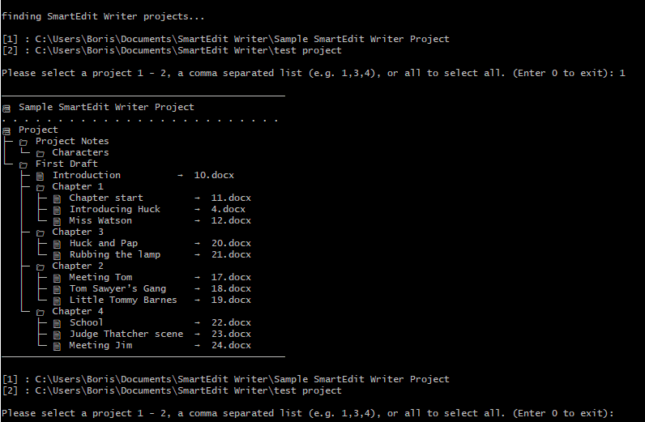
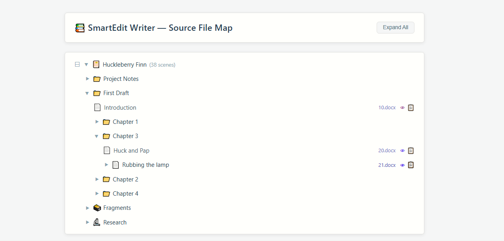

# SmartEdit Writer Explorer

A Python utility that maps SmartEdit Writer projects to a navigable tree of scenes, notes, and files — with terminal output or interactive HTML reports.

## Overview

- **About SmartEdit Writer**: [SmartEdit Writer](https://smart-edit.com/) is a novel writing software; text in SmartEdit Writer is broken down into "scenes" and "notes."
- **How SmartEdit Writer stores files**: When you create a scene or note in the SmartEdit Writer GUI, a file is written to the file system (in the project's `Documents/` directory) with the item's content — scenes as `.docx`, notes as `.rtf`. The filenames are integers (`1.docx`, `2.rtf`, etc.). Furthermore, when existing images and other attachments are added to the project, a copy of them is added to the project's `Files/` directory with a similar integer naming convention: `50.jpg`, `56.pdf`.
- **The problem**: There is no obvious mapping between items and their corresponding integer filenames, and the GUI provides no means to determine an item's source file on the file system.
- **The solution this tool provides**: This utility finds that mapping: it opens a SmartEdit Writer project's SQLite database, determines the mapping between all project items (scenes, notes, and file attachments) and their source files, and displays this info to the user — either on stdout as a formatted tree, or in a generated HTML report with collapsible folders and direct links to source files. Supports all three SmartEdit Writer sections: Manuscript, Fragments, and Research.

## Dependencies

- Windows OS
- Python 3.7+
- BeautifulSoup 4.13.3 (installed via `requirements.txt`)
- mammoth>=1.12.0 (installed via `requirements.txt`) **only required if using `--convert`** (requires Python 3.8+)
- striprtf>=0.0.32 (installed via `requirements.txt`) **only required if using `--convert`**

## Quickstart

```
git clone https://github.com/bkuz114/smartedit-explorer.git --recursive && cd smartedit-explorer
pip install -r requirements.txt
python explorer.py
```

This is the most basic usage; it will search for all SmartEdit Writer projects rooted in your `Documents` folder and prompt you to select one. Then it will determine the scene / source file mapping and display it for you on stdout. (Note: to change the search root, supply `--search-root`. Alternatively, to specify a specific SmartEdit project, use `--project`.)



## HTML Reports

A static HTML report can be created instead of displaying the mapping on stdout. Use `--html` to generate a report with collapsible folders, source file links, and optional inline document viewing (`--convert`). (See usage options below for full list of options around HTML reports.)



## `explorer.py` Options

Usage:

`python explorer.py [--project PROJECT...] [--search-root PATH] [--norecursive] [--short] [--html] [--merge] [--browser] [--output PATH] [--convert] [--style STYLE] [--reuse] [--html-output PATH] [--force-html] [--force] [--force-assets] [--nuclear]`

Options:

`--project PROJECT`, `-p PROJECT`

_Optional_. Absolute or relative path to one or more SmartEdit Writer projects. Can be supplied multiple times (e.g. `-p proj1 -p proj2`). If not given, the tool will search for all SmartEdit Writer projects rooted in the user's Documents folder (or `--search-root` if supplied) and prompt you to select one or more.

`--search-root PATH`

_Optional_. Directory to search for SmartEdit Writer projects when `--project` is not supplied. Defaults to the user's Documents folder. Ignored if `--project` is given.

`--norecursive`

_Optional, defaults to False_. When searching for SmartEdit Writer projects (i.e. `--project` is not supplied), limit the search to the top-level directory only. Speeds up the search but may miss projects nested in subdirectories.

`--short`, `-s`

_Optional, defaults to False_. When displaying the scene / source file mapping, only display the filenames of the source files — not their absolute paths.

`--html`

_Optional, defaults to False_. Generate an HTML report with the scene / source file mapping. Without this flag, the mapping displays on stdout. By default, a separate report is generated for each project in the current working directory, named after the project (e.g. `My Novel.html`). Use `--merge` to combine all projects into a single report, written to `./report.html` unless `--output` is supplied.

`--merge`

_Optional, defaults to False_. Combine all selected projects into a single HTML report. Without this flag, each project generates its own report file. Requires `--html`.

`--browser`

_Optional, defaults to False_. Open the generated HTML report(s) in the default browser upon completion. Requires `--html`.

`--convert`

_Optional, defaults to False_. Convert .docx and .rtf source files to HTML for inline viewing in the report. Each scene gets a view icon (👁) next to its source link, opening the content in a new browser tab. Requires `--html`. Dependencies: `mammoth` (for .docx) and `striprtf` (for .rtf), installable via `pip install mammoth striprtf`.

`--style STYLE`

_Optional, defaults to `default`_. CSS theme for converted HTML files when using `--convert`. Available styles are discovered from `assets/css/converted/`. Use `--style none` for no styling. Requires `--convert`.

`--reuse`

_Optional, defaults to False_. Skip conversion of source files whose converted HTML output already exists on disk. Significantly speeds up repeated report generation for large projects. Files that haven't been converted yet are still processed. Requires `--convert`.

`--output PATH`

_Optional_. When `--merge` is supplied, this is the output file path (default: `./report.html`). When `--merge` is not supplied, this is the output directory where per-project reports are written (default: current working directory). Requires `--html`. Relative paths are resolved relative to the current working directory. When `--convert` is used, converted HTML files are written to a subdirectory alongside the report.

`--html-output PATH`

_Optional_. Directory for converted HTML files when using `--convert`. Defaults to `<output-dir>/html/`. Requires `--html` and `--convert`.

`--force`

_Optional, defaults to False_. Overwrite the HTML report file if it already exists. If the report exists and `--force` is not supplied, the script will exit with an error.

`--force-assets`

_Optional, defaults to False_. Overwrite the assets/ directory (CSS, JS, favicon) at the output location if it already exists. If the assets/ directory exists and `--force-assets` is not supplied, the copy is skipped and existing assets are used as-is — this preserves any user customizations. Separate from `--force` so you can refresh the report without nuking custom CSS or JS.

`--force-html`

_Optional, defaults to False_. Overwrite existing converted HTML files when using `--convert`.

`--nuclear`

_Optional, defaults to False_. USE AT YOUR OWN RISK. Force-deletes the assets/ directory at the output location by stripping read-only permissions before retrying. Only needed on Windows when `--force-assets` fails with "Access is denied" errors (caused by antivirus, search indexer, or Explorer holding transient file locks).

### Interactive Project Selection

When `--project` is not supplied, the script searches for SmartEdit Writer projects and presents a numbered list. You can select projects by:

  - A single number: `3`
  - A comma-separated list: `1,3,4`
  - A range (inclusive): `4-7`
  - Mixed: `2,4-7,9`
  - `all` to select every discovered project
  - `0` to exit

### HTML Report Assets

The generated HTML report is fully self-contained. When `--html` is used, the script automatically copies the required assets (CSS, JavaScript, favicon) alongside the report. No manual setup is required.

For reference, the asset directory structure:

    assets/
    ├── css/
    │   └── style.css
    ├── js/
    │   └── scripts.js
    └── images/
        └── favicon.ico
